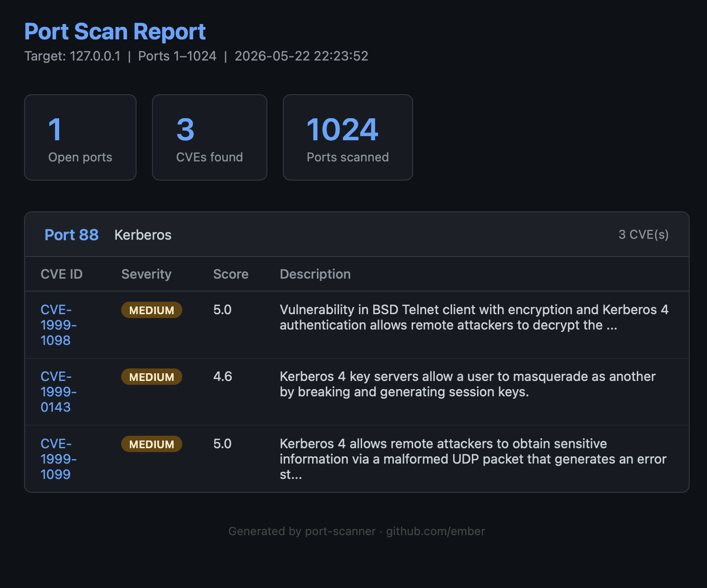

# Port Scanner with CVE Lookup

A Python-based network port scanner that identifies open ports, detects running services, and maps them to known vulnerabilities using the National Vulnerability Database (NVD) API.

## Features
- Threaded scanning — 1024 ports in under 5 seconds
- Service identification for 16 common protocols
- Live CVE lookup via the NVD API with severity scores
- Generates HTML and JSON reports

## Example Output



## Setup

```bash
git clone https://github.com/YOUR_USERNAME/port-scanner
cd port-scanner
python3 -m venv venv
source venv/bin/activate
pip install requests
```

Get a free NVD API key at https://nvd.nist.gov/developers/request-an-api-key

Copy `modules/cve_lookup_example.py` to `modules/cve_lookup.py` and add your key.

## Usage

```bash
python3 scanner.py 127.0.0.1 --start 1 --end 1024
python3 scanner.py 127.0.0.1 --start 1 --end 1024 --threads 200
```

## Legal

Only scan hosts you own or have explicit written permission to scan.

## Tech Stack
- Python 3.13
- `socket` — port scanning
- `concurrent.futures` — threading
- `requests` — NVD API integration